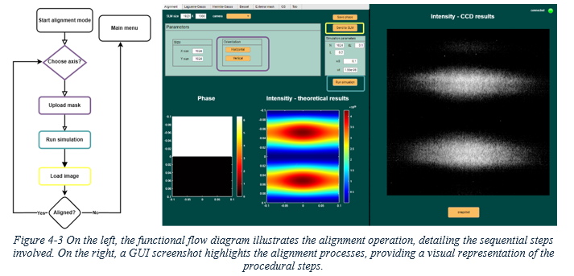
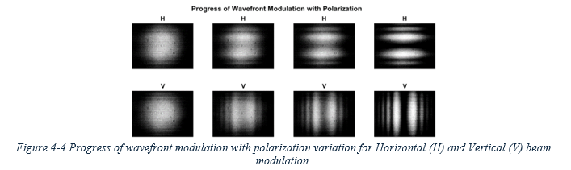
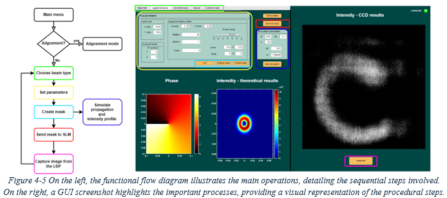

# GUI for Structured Light Manipulation

This folder contains the source code for the graphical user interface (GUI) developed for structured light manipulation. The GUI is provided in the file `GUI_for_SLM.mlapp`, and an installer is available as `GUI_for_SLM.mlappinstall`. To install the app, simply execute the installer file in your MATLAB environment.

## Overview

The GUI has been specifically designed to enhance the intuitive and convenient manipulation of structured light. This document provides an overview of its primary functionalities and practical examples for alignment and beam generation procedures.

## Features

### 1. Alignment and Light Modulation

  

- **Initial Setup**: The GUI starts on the Alignment tab, essential for effective wavefront modulation. Proper alignment in both horizontal and vertical directions is crucial to ensure correct wavefront modulation.
- **Alignment Procedure**:
  - Select the alignment direction as shown in the GUI.
  - A generated phase mask for alignment will be displayed.
  - Run simulations to visualize the intensity profile, and adjust parameters as needed. The simulations use the Fraunhofer integral and convolutions in Fourier space to simulate propagation and extract the intensity profile.
  - Send the phase mask to the Spatial Light Modulator (SLM) and view results captured by the Laser Beam Profile (LBP) on the right side of the tab.
  - Repeat the process for the other direction to achieve perfect alignment.

- **Polarization Considerations**: 

  

Ensure the incident beam is polarized to align with the liquid crystal’s optical axis. Use the polarization controller.

### 2. Structured Light Generation

  

- **Beam Types**: Select from different beam types: Laguerre-Gaussian (L-G), Hermite-Gaussian (H-G), and Bessel-Gaussian (B-G).
- **Parameter Adjustment**: Modify various parameters for mask generation such as size, beam orders, and radius.
- **Mask Generation**:
  - Generate the desired beam mask, grating, or forked mask according to the matrix equations representing intensity levels on each pixel of the SLM matrix.
  - Simulate the intensity profile, send the mask to the SLM, and visualize the results.
  - Save images of the results if desired.
- **Custom Masks**: Use the External Masks tab to upload and preview custom phase mask designs. Apply these masks to the SLM in a manner similar to other beam types.

## Installation

1. **Download the Installer**: Obtain `GUI_for_SLM.mlappinstall` from the repository.
2. **Run the Installer**: Execute the installer file in MATLAB to install the app.

## Source Code

The source code for the GUI, including all numerical routines for mask generation, SLM communication, and simulations, is available in the file `GUI_for_SLM.mlapp`.

## Contributing

For improvements or suggestions, please create a pull request or open an issue.

## License

This project is licensed under the MIT License. See the [LICENSE](../LICENSE) file in the parent directory for more details.

## Acknowledgements

Thanks to all contributors and the open-source community for their support and tools.

---

Enjoy using the GUI for structured light manipulation!
